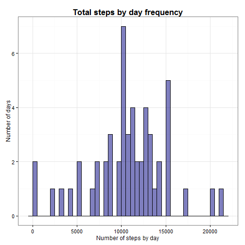

Coursera -> Reproducible Research - Peer Assessment 1
========================================================

Dated: 07-19-2014

By: Rupesh Vinaykya

Peer assessment 1 assignment for Coursera course [Reproducible Research](Reproducible Research).

> ## Introduction
> 
> It is now possible to collect a large amount of data about personal
> movement using activity monitoring devices such as a
> [Fitbit](http://www.fitbit.com), [Nike
> Fuelband](http://www.nike.com/us/en_us/c/nikeplus-fuelband), or
> [Jawbone Up](https://jawbone.com/up). These type of devices are part of
> the "quantified self" movement -- a group of enthusiasts who take
> measurements about themselves regularly to improve their health, to
> find patterns in their behavior, or because they are tech geeks. But
> these data remain under-utilized both because the raw data are hard to
> obtain and there is a lack of statistical methods and software for
> processing and interpreting the data.
> 
> This assignment makes use of data from a personal activity monitoring
> device. This device collects data at 5 minute intervals through out the
> day. The data consists of two months of data from an anonymous
> individual collected during the months of October and November, 2012
> and include the number of steps taken in 5 minute intervals each day.
> 
> ## Data
> 
> The data for this assignment can be downloaded from the course web
> site:
> 
> * Dataset: [Activity monitoring data](https://d396qusza40orc.cloudfront.net/repdata%2Fdata%2Factivity.zip) [52K]
> 
> The variables included in this dataset are:
> 
> * **steps**: Number of steps taking in a 5-minute interval (missing
>     values are coded as `NA`)
> 
> * **date**: The date on which the measurement was taken in YYYY-MM-DD
>     format
> 
> * **interval**: Identifier for the 5-minute interval in which
>     measurement was taken
> 
> 
> 
> 
> The dataset is stored in a comma-separated-value (CSV) file and there
> are a total of 17,568 observations in this
> dataset.
> 
> 
> ## Assignment
> 
> This assignment will be described in multiple parts. You will need to
> write a report that answers the questions detailed below. Ultimately,
> you will need to complete the entire assignment in a **single R
> markdown** document that can be processed by **knitr** and be
> transformed into an HTML file.
> 
> Throughout your report make sure you always include the code that you
> used to generate the output you present. When writing code chunks in
> the R markdown document, always use `echo = TRUE` so that someone else
> will be able to read the code. **This assignment will be evaluated via
> peer assessment so it is essential that your peer evaluators be able
> to review the code for your analysis**.
> 
> For the plotting aspects of this assignment, feel free to use any
> plotting system in R (i.e., base, lattice, ggplot2)
> 
> Fork/clone the [GitHub repository created for this
> assignment](http://github.com/rdpeng/RepData_PeerAssessment1). You
> will submit this assignment by pushing your completed files into your
> forked repository on GitHub. The assignment submission will consist of
> the URL to your GitHub repository and the SHA-1 commit ID for your
> repository state.
> 
> NOTE: The GitHub repository also contains the dataset for the
> assignment so you do not have to download the data separately.
> 
> 
> 

First Load Packages.


```r
packages <- c("data.table", "ggplot2", "xtable", "VIM", "lattice")
sapply(packages, require, character.only=TRUE, quietly=TRUE)
```

```
## Warning: package 'data.table' was built under R version 3.1.1
## Warning: package 'ggplot2' was built under R version 3.1.1
## Warning: package 'VIM' was built under R version 3.1.1
## Warning: package 'colorspace' was built under R version 3.1.1
```

```
## VIM is ready to use. 
##  Since version 4.0.0 the GUI is in its own package VIMGUI.
## 
##           Please use the package to use the new (and old) GUI.
## 
## 
## Attaching package: 'VIM'
## 
## The following object is masked from 'package:datasets':
## 
##     sleep
```

```
## Warning: package 'lattice' was built under R version 3.1.1
```

```
## data.table    ggplot2     xtable        VIM    lattice 
##       TRUE       TRUE       TRUE       TRUE       TRUE
```

> ### Loading and preprocessing the data
> 
> Show any code that is needed to
> 
> 1. Load the data (i.e. `read.csv()`)
> 
> 2. Process/transform the data (if necessary) into a format suitable for your analysis

Read the CSV file.
Convert the data frame to a data table using the [`data.table`](http://cran.r-project.org/web/packages/data.table/index.html) package.


```r
dt <- read.csv(file.path(getwd(), "activity.csv"))
dt <- data.table(dt)
```

Check the number of rows in the dataset is the expected value of 17,568.


```r
check <- nrow(dt) == 17568
if (check == FALSE) stop("The number of rows in the dataset is not 17,568.")
```

Convert the `date` variable to a date class.
And look at the structure of the dataset.


```r
dt <- dt[, date := as.Date(date)]
setkey(dt, date, interval)
str(dt)
```

```
## Classes 'data.table' and 'data.frame':	17568 obs. of  3 variables:
##  $ steps   : int  NA NA NA NA NA NA NA NA NA NA ...
##  $ date    : Date, format: "2012-10-01" "2012-10-01" ...
##  $ interval: int  0 5 10 15 20 25 30 35 40 45 ...
##  - attr(*, ".internal.selfref")=<externalptr> 
##  - attr(*, "sorted")= chr  "date" "interval"
```

The variable 'date' has been read as a Factor. Going to check it converted  into Date class:


```r
class(dt$date)
```

```
## [1] "Date"
```
Type of Data


```r
dt
```

```
##        steps       date interval
##     1:    NA 2012-10-01        0
##     2:    NA 2012-10-01        5
##     3:    NA 2012-10-01       10
##     4:    NA 2012-10-01       15
##     5:    NA 2012-10-01       20
##    ---                          
## 17564:    NA 2012-11-30     2335
## 17565:    NA 2012-11-30     2340
## 17566:    NA 2012-11-30     2345
## 17567:    NA 2012-11-30     2350
## 17568:    NA 2012-11-30     2355
```

```r
summary(dt)
```

```
##      steps            date               interval   
##  Min.   :  0.0   Min.   :2012-10-01   Min.   :   0  
##  1st Qu.:  0.0   1st Qu.:2012-10-16   1st Qu.: 589  
##  Median :  0.0   Median :2012-10-31   Median :1178  
##  Mean   : 37.4   Mean   :2012-10-31   Mean   :1178  
##  3rd Qu.: 12.0   3rd Qu.:2012-11-15   3rd Qu.:1766  
##  Max.   :806.0   Max.   :2012-11-30   Max.   :2355  
##  NA's   :2304
```

How many missing value are there in the dataset?


```r
sum(is.na(dt$steps))
```

```
## [1] 2304
```

> ### What is mean total number of steps taken per day?
> 
> For this part of the assignment, you can ignore the missing values in
> the dataset.
> 
> 1. Make a histogram of the total number of steps taken each day
> 
> 2. Calculate and report the **mean** and **median** total number of steps taken per day

Now, create a new dataset in which removing all missing values:


```r
dt_NA <- dt[!is.na(dt$steps), ]
```
       
And then see file has been removed missing value.      
      

```r
head(dt_NA)        
```

```
##    steps       date interval
## 1:     0 2012-10-02        0
## 2:     0 2012-10-02        5
## 3:     0 2012-10-02       10
## 4:     0 2012-10-02       15
## 5:     0 2012-10-02       20
## 6:     0 2012-10-02       25
```


```r
head(dt)
```

```
##    steps       date interval
## 1:    NA 2012-10-01        0
## 2:    NA 2012-10-01        5
## 3:    NA 2012-10-01       10
## 4:    NA 2012-10-01       15
## 5:    NA 2012-10-01       20
## 6:    NA 2012-10-01       25
```
Now we calculate the mean of steps per day, ignoring missing values, so I'm going to take "dt_NA" dataset:

- 1st, I split the dataset into diferent days:


```r
splitDataByDate <- split(dt_NA$steps, dt_NA$date)
```

- 2nd, I create a vector with all days in dataset:


```r
allDays <- as.Date(sort(unique(dt_NA$date)), format = "%Y-%m-%d")
```

- And now I'm calculate sum, mean and median of all step splitted by day:


```r
sumStepByDate <- as.data.frame(sapply(splitDataByDate, sum))
names(sumStepByDate) <- c("Steps")
mean(sumStepByDate$Steps)
```

```
## [1] 10766
```


```r
median(sumStepByDate$Steps)
```

```
## [1] 10765
```

Now generate a histogram with the frecuency of total sum of steps by day:


```r
hist(sumStepByDate$Steps, main="Total steps by day frecuency", xlab="Number of steps by day", ylab="Number of days", col="red", breaks = nrow(sumStepByDate))
```


```r
dev.off()
```

```
## null device 
##           1
```

Aggregate the number of steps taken each day.Days with missing values (`NA`) will have `NA` when aggregated.


```r
dtDaily <- dt[, list(sumSteps = sum(steps)), date]
head(dtDaily)
```

```
##          date sumSteps
## 1: 2012-10-01       NA
## 2: 2012-10-02      126
## 3: 2012-10-03    11352
## 4: 2012-10-04    12116
## 5: 2012-10-05    13294
## 6: 2012-10-06    15420
```

Again plot a histogram of the total number of steps taken each day, by **ggplot() function**.


```r
p <-
ggplot(dtDaily, aes(x = sumSteps)) + geom_histogram(alpha = 1/2, binwidth = 500, color="black",fill="navyblue")
p.labs <- p + labs(title = "Total steps by day frequency", x = "Number of steps by day", y = "Number of days") + theme_bw() 
black.bold.plain.14.text <- element_text(face = "bold", color = "black",size = 14)
black.text <- element_text(face = "plain", color = "black",size = 12)
black.bold.plain.10.5.text <- element_text(face = "plain", color = "black", size = 10.5)
p.labs + theme(title = black.bold.plain.14.text, axis.title = black.text) + theme(axis.text = black.bold.plain.10.5.text)
```



Calculate mean and median total number of steps taken per day, **before imputing**.


```r
tab <- dtDaily[, list(n = .N, nValid = sum(!is.na(sumSteps)), mean = mean(sumSteps, na.rm=TRUE), median = median(sumSteps, na.rm=TRUE))]
print(xtable(tab), type="html", include.rownames=FALSE)
```

<!-- html table generated in R 3.1.0 by xtable 1.7-3 package -->
<!-- Sat Jul 19 13:17:49 2014 -->
<TABLE border=1>
<TR> <TH> n </TH> <TH> nValid </TH> <TH> mean </TH> <TH> median </TH>  </TR>
  <TR> <TD align="right">  61 </TD> <TD align="right">  53 </TD> <TD align="right"> 10766.19 </TD> <TD align="right"> 10765 </TD> </TR>
   </TABLE>

Save the data table `dtDaily` before imputation to be used later.


```r
dtDaily <- dtDaily[, status := "Before imputation"]
dtDailyBeforeImputation <- dtDaily
```

> ### What is the average daily activity pattern?
> 
> 1. Make a time series plot (i.e. `type = "l"`) of the 5-minute interval (x-axis) and the average number of steps taken, averaged across all days (y-axis)
> 
> 2. Which 5-minute interval, on average across all the days in the dataset, contains the maximum number of steps?

Aggregate the average number of steps taken by 5-minute interval.


```r
dtIntervals <- dt[, list(meanSteps = mean(steps, na.rm=TRUE)), interval]
```

Plot a time series of the 5-minute interval and the average number of steps taken across all days.


```r
dt$interval <- factor(dt$interval)

calc_steps <- function(dt) {
    steps_pi <- aggregate(dt$steps, by=list(interval=dt$interval),                                                             FUN=mean, na.rm=T)
    # convert to integers for plotting
    steps_pi$interval <- as.integer(levels(steps_pi$interval)[steps_pi$interval])
    colnames(steps_pi) <- c("interval", "steps")
    steps_pi
}

plot_activity_pattern <- function(steps_per_interval, max_step_interval) {
    col_labels=c(paste("Interval with Maximum Activity: ", max_step_interval))
    cols = c("red")

    ggplot(steps_per_interval, aes(x=interval, y=steps)) +   
        geom_line(color="royalblue", size=1) +  
        geom_point(aes(x=max_step_interval, y=0, color="red"), size=4, shape=15) +  
        scale_color_manual(name=element_blank(), labels=col_labels, values=cols) +     
        labs(title="Average Daily Activity Pattern", x="5 Minute Interval", y="Avg Number of steps") +  theme_bw() + theme(legend.position = "bottom")
}

        steps_per_interval <- calc_steps(dt)
        max_step_interval <- steps_per_interval[which.max(steps_per_interval$steps),]$interval

plot_activity_pattern(steps_per_interval, max_step_interval)
```


```r
splitDataByInterval <- split(dt_NA$steps, dt_NA$interval)
meanStepByInterval <- as.data.frame(sapply(splitDataByInterval, mean))
names(meanStepByInterval) <- c("Steps")
max1 <- max(meanStepByInterval$Steps)
```


```r
totPerInterval<-sapply(split(dt$steps,dt$interval),sum,na.rm=T)
indMax <- which.max(totPerInterval)
```

The 5 minute interval that on average across all the days in the dataset  contains the maximum number of steps is the **835**, the maximun is **206.1698**  and it contain 10927 steps.

> ### Imputing missing values
> 
> Note that there are a number of days/intervals where there are missing
> values (coded as `NA`). The presence of missing days may introduce
> bias into some calculations or summaries of the data.
> 
> 1. Calculate and report the total number of missing values in the dataset (i.e. the total number of rows with `NA`s)
> 
> 2. Devise a strategy for filling in all of the missing values in the dataset. The strategy does not need to be sophisticated. For example, you could use the mean/median for that day, or the mean for that 5-minute interval, etc.
> 
> 3. Create a new dataset that is equal to the original dataset but with the missing data filled in.
> 
> 4. Make a histogram of the total number of steps taken each day and Calculate and report the **mean** and **median** total number of steps taken per day. Do these values differ from the estimates from the first part of the assignment? What is the impact of imputing missing data on the estimates of the total daily number of steps?

1.Calculate the total number of missing values.

And non missing values are...


```r
dt <- dt[,`:=`(isStepsMissing, is.na(steps))]
tab <- dt[, .N, isStepsMissing]
print(xtable(tab), type = "html", include.rownames = FALSE)
```

<!-- html table generated in R 3.1.0 by xtable 1.7-3 package -->
<!-- Mon Jul 21 02:27:04 2014 -->
<TABLE border=1>
<TR> <TH> isStepsMissing </TH> <TH> N </TH>  </TR>
  <TR> <TD> TRUE </TD> <TD align="right"> 2304 </TD> </TR>
  <TR> <TD> FALSE </TD> <TD align="right"> 15264 </TD> </TR>
   </TABLE>

Use the [VIM](http://cran.r-project.org/web/packages/VIM/index.html) package to impute missing values of the `steps` variable.
Use k-Nearest Neighbour Imputation.


```r
dt <- kNN(dt)
```

```
## Time difference of -9.13 secs
```

The `kNN` function returns a dataset with all `NA`s replaced.

Verify that missingness is complete for an entire day.
Show all days with at least 1 missing value. Calculate the proportion of records with missing values for each such day.All missing data fill.


```r
tab <- dt[, .N, list(isMissing = is.na(steps))]
print(xtable(tab),  type = "html", include.rownames = FALSE)
```

<!-- html table generated in R 3.1.0 by xtable 1.7-3 package -->
<!-- Mon Jul 21 02:27:13 2014 -->
<TABLE border=1>
<TR> <TH> isMissing </TH> <TH> N </TH>  </TR>
  <TR> <TD> FALSE </TD> <TD align="right"> 17568 </TD> </TR>
   </TABLE>

Above is a new value which now is a total value after filling the missing value.dt


```r
dtMissingness <- dt[, list(countMissing = sum(isStepsMissing), countRecords = .N, 
    propMissing = sum(isStepsMissing/.N)), date]
dtMissingness[countMissing > 0]
```

```
##          date countMissing countRecords propMissing
## 1: 2012-10-01          288          288           1
## 2: 2012-10-08          288          288           1
## 3: 2012-11-01          288          288           1
## 4: 2012-11-04          288          288           1
## 5: 2012-11-09          288          288           1
## 6: 2012-11-10          288          288           1
## 7: 2012-11-14          288          288           1
## 8: 2012-11-30          288          288           1
```


```r
summary (dt)
```

```
##      steps            date               interval     isStepsMissing 
##  Min.   :  0.0   Min.   :2012-10-01   0      :   61   Mode :logical  
##  1st Qu.:  0.0   1st Qu.:2012-10-16   5      :   61   FALSE:15264    
##  Median :  0.0   Median :2012-10-31   10     :   61   TRUE :2304     
##  Mean   : 33.9   Mean   :2012-10-31   15     :   61   NA's :0        
##  3rd Qu.:  9.0   3rd Qu.:2012-11-15   20     :   61                  
##  Max.   :806.0   Max.   :2012-11-30   25     :   61                  
##                                       (Other):17202                  
##  steps_imp      
##  Mode :logical  
##  FALSE:15264    
##  TRUE :2304     
##  NA's :0        
##                 
##                 
## 
```

#### After imputation of missing values

Aggregate the number of steps taken each day.


```r
dtDaily <- dt[, list(sumSteps = sum(steps), isImputed = sum(steps_imp) > 0), date]
head(dtDaily)
```

```
##          date sumSteps isImputed
## 1: 2012-10-01     3036      TRUE
## 2: 2012-10-02      126     FALSE
## 3: 2012-10-03    11352     FALSE
## 4: 2012-10-04    12116     FALSE
## 5: 2012-10-05    13294     FALSE
## 6: 2012-10-06    15420     FALSE
```


```r
dt
```

```
##        steps       date interval isStepsMissing steps_imp
##     1:     0 2012-10-01        0           TRUE      TRUE
##     2:     0 2012-10-01        5           TRUE      TRUE
##     3:     0 2012-10-01       10           TRUE      TRUE
##     4:     0 2012-10-01       15           TRUE      TRUE
##     5:     0 2012-10-01       20           TRUE      TRUE
##    ---                                                   
## 17564:     0 2012-11-30     2335           TRUE      TRUE
## 17565:     0 2012-11-30     2340           TRUE      TRUE
## 17566:     0 2012-11-30     2345           TRUE      TRUE
## 17567:     0 2012-11-30     2350           TRUE      TRUE
## 17568:     0 2012-11-30     2355           TRUE      TRUE
```

Plot a histogram of the total number of steps taken each day **after imputing** and compare with the histogram **before imputing**.
Need to add an `isImputed` column to `dtDailyBeforeImputation` to make `rbind` work.


```r
dtDaily <- dtDaily[, status := "After imputation"]
dtDailyBeforeImputation <- dtDailyBeforeImputation[, isImputed := FALSE]
dtDaily <- rbind(dtDaily, dtDailyBeforeImputation, use.names=TRUE)
ggplot(dtDaily, aes(x=sumSteps, fill=isImputed)) +
        geom_histogram(alpha=1/2, binwidth=500) +
  facet_wrap(~ status, nrow=4) +
  theme(legend.position="bottom") + theme_minimal() + labs(x="Number of steps by day", y="Number of days")
```


Calculate the mean and median total number of steps taken per day **after imputing**.


```r
tab <- dtDaily[, list(n = .N, nValid = sum(!is.na(sumSteps)), mean = mean(sumSteps, na.rm=TRUE), median = median(sumSteps, na.rm=TRUE)), status]
print(xtable(tab), type="html", include.rownames=FALSE)
```

<!-- html table generated in R 3.1.0 by xtable 1.7-3 package -->
<!-- Mon Jul 21 02:27:14 2014 -->
<TABLE border=1>
<TR> <TH> status </TH> <TH> n </TH> <TH> nValid </TH> <TH> mean </TH> <TH> median </TH>  </TR>
  <TR> <TD> After imputation </TD> <TD align="right">  61 </TD> <TD align="right">  61 </TD> <TD align="right"> 9752.39 </TD> <TD align="right"> 10395.00 </TD> </TR>
  <TR> <TD> Before imputation </TD> <TD align="right">  61 </TD> <TD align="right">  53 </TD> <TD align="right"> 10766.19 </TD> <TD align="right"> 10765.00 </TD> </TR>
   </TABLE>

The median of the imputed values is the same as the original values where missing values were not imputed.
However, the mean of the imputed values is **less than** the original values.
The overall impact of the imputed values is to **lower** the estimates of the number of steps taken each day.

> ### Are there differences in activity patterns between weekdays and weekends?
> 
> For this part the `weekdays()` function may be of some help here. Use
> the dataset with the filled-in missing values for this part.
> 
> 1. Create a new factor variable in the dataset with two levels -- "weekday" and "weekend" indicating whether a given date is a weekday or weekend day.
> 
> 1. Make a panel plot containing a time series plot (i.e. `type = "l"`) of the 5-minute interval (x-axis) and the average number of steps taken, averaged across all weekday days or weekend days (y-axis). The plot should look something like the following, which was creating using **simulated data**:
> 
>  
> 
> **Your plot will look different from the one above** because you will
> be using the activity monitor data. Note that the above plot was made
> using the lattice system but you can make the same version of the plot
> using any plotting system you choose.

Create a new factor variable in the dataset with two levels -- "weekday" and "weekend" indicating whether a given date is a weekday or weekend day.
Use this solution to [collapse the factor values](http://stackoverflow.com/a/9053619) for day of week.
Verify that `IntervalWD` and `IntervalWE` are factor class variables.

Overlay the time series on a single plot instead of using a panel plot.


```r
dt$Days <- weekdays(as.Date(as.character(dt$date)))
d <- dt$Days == "Saturday" | dt$Days == "Sunday"
dt$Days[d] = "Weekend"
dt$Days[!d] = "Weekday"
dtWD <- dt[dt$Days == "Weekday", ]
dtWE <- dt[dt$Days == "Weekend", ]
IntervalWD <- as.numeric(levels(as.factor(dtWD$interval)))
IntervalWE <- as.numeric(levels(as.factor(dtWE$interval)))
avgWD <- tapply(dtWD$steps, dtWD$interval, mean)
avgWE <- tapply(dtWE$steps, dtWE$interval, mean)
dfWD <- data.frame(avgWD, IntervalWD)
dfWE <- data.frame(avgWE, IntervalWE)
dt$Days <- as.factor(dt$Days)
dt$interval <- as.factor(dt$interval)
plot(dfWD$IntervalWD, dfWD$avgWD, type = "l", main = "Comparison of the Average Number of Steps\n between Weekdays and the Weekend",
    xlab = "Interval", ylab = "Number of Steps")
lines(dfWE$IntervalWE, dfWE$avgWE, col = "red")
legend("topright", c("Weekday", "Weekend"), col = c("black", "red"), lty = 1)
```


Plot two time series (one for weekdays and the other for weekends) of the 5-minute intervals and average number of steps taken (imputed values).


```r
dfWD$wDays <- rep("Weekday", nrow(dfWD))
dfWE$wDays <- rep("Weekend", nrow(dfWD))
# Rename column names to match
colnames(dfWD) <- c("Steps", "Interval", "wDays")
colnames(dfWE) <- c("Steps", "Interval", "wDays")
# rbind the dataframes
df <- rbind(dfWD, dfWE)
# Convert wDays column into a factor
df$wDays <- factor(df$wDays)

# Use lattice library to plot
library(lattice)
xyplot(Steps ~ Interval | wDays, data = df, type = "l", layout = c(1, 2), ylab = "Average Number of Steps")
```


> ## Submitting the Assignment
> 
> To submit the assignment:
> 
> 1. Commit the your completed `PA1_template.Rmd` file to the `master` branch of
> your git repository (you should already be on the `master` branch unless you
> created new ones)
> 
> 2. Commit your `PA1_template.md` and `PA1_template.html` files produced by
> processing your R markdown file with `knit2html()` function in R (from the
> **knitr** package)
> 
> 3. If your document has figures included (it should) then they should have
> been placed in the `figures/` directory by default (unless you overrided the
> default). Add and commit the `figures/` directory to yoru git repository.
> 
> 4. Push your `master` branch to GitHub.
> 
> 5. Submit the URL to your GitHub repository for this assignment on the course
> web site.
> 
> In addition to submitting the URL for your GitHub repository, you will
> need to submit the 40 character SHA-1 hash (as string of numbers from
> 0-9 and letters from a-f) that identifies the repository commit that
> contains the version of the files you want to submit. You can do this
> in GitHub by doing the following
> 
> 1. Going to your GitHub repository web page for this assignment
> 
> 2. Click on the "?? commits" link where ?? is the number of commits you have
> in the repository. For example, if you made a total of 10 commits to this
> repository, the link should say "10 commits".
> 
> 3. You will see a list of commits that you have made to this repository. The
> most recent commit is at the very top. If this represents the version of the
> files you want to submit, then just click the "copy to clipboard" button on
> the right hand side that should appear when you hover over the SHA-1 hash.
> Paste this SHA-1 hash into the course web site when you submit your
> assignment. If you don't want to use the most recent commit, then go down and
> find the commit you want and copy the SHA-1 hash.> 
> 
> A valid submission will look something like (this is just an **example**!)
> 
> ```r
> https://github.com/rdpeng/RepData_PeerAssessment1
> 
> 7c376cc5447f11537f8740af8e07d6facc3d9645
> ```
